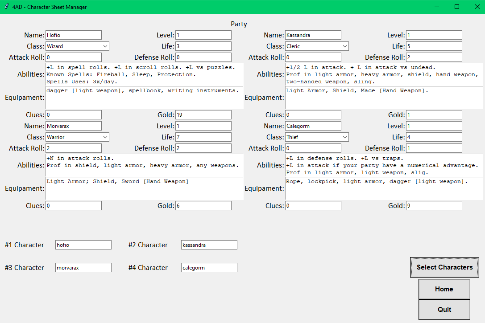
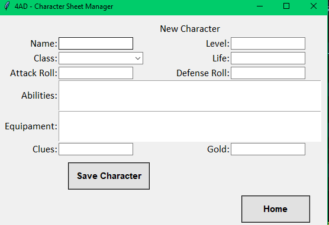

# 4AD-Character-Sheet-Manager
4AD - Character Sheet Manager is a character management application for Four Against Darkness, a Solo Tabletop RPG.

## About the Project
This is my second "finished" project using Python.
It's a character sheet manager for Four Against Darkness. It's a relatively simple CRUD, using TKinter as the GUI and SQLite as the database.

## What did I learn?
At first I considered using OOP, but the "characters" didn't have any relevant methods, so halfway through the project I switched to just dictionaries.

It was harder than I thought it would be, but I'm happy to have finished it and left it partially functional.

There are things to improve, like bug fixes and errors, there are a lot of them. But I'll test other things and study more before moving on to the next project.

